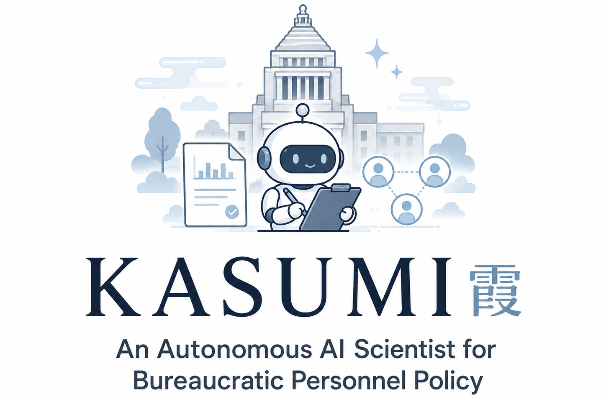

<p align="center">
  
  
  
  
  
  
</p>

<p align="center">
  
</p>

# KASUMI: An Autonomous AI Scientist for Bureaucratic Personnel Policy

<p align="center">
  <a href="https://shogonoguchi.github.io/KASUMI/"><strong>Project page</strong></a> ·
  <a href="paper/FINAL_POLICY_PAPER.pdf"><strong>Generated paper</strong></a> ·
  <a href="artifacts/evidence/development_selection_summary.json"><strong>Evidence JSON</strong></a> ·
  <a href="#quickstart-replay-the-public-evidence-bundle"><strong>Replay</strong></a> ·
  <a href="docs/SOURCES.md"><strong>Source notes</strong></a>
</p>

**KASUMI** is a synthetic, end-to-end policy-science workflow for studying **bureaucratic personnel policy** in a simulated public-service organization. It combines AI-Scientist-style idea generation, a Shachi-style LLM-agent/ABM environment, frozen multiseed holdout evaluation, evidence-bound writing, numeric claim verification, and automated review.

> **Claim boundary.** KASUMI reports synthetic simulation evidence only. It is not a real-world causal estimate, a personnel evaluation system, a digital twin of any actual ministry, or an operational policy recommendation.

## Why KASUMI exists

Japanese central-government personnel policy has become a visible public-administration problem: public discussion has highlighted long working hours, career uncertainty, uneven workload allocation, young-official attrition, and the need for strategic staffing and talent-management systems. The Cabinet Secretariat young-official proposal explicitly discusses moving personnel transfers from seniority-based rotation toward opt-in/post-based mobility, strengthening strategic HR systems, talent-management infrastructure, training visibility, and staffing levels that do not assume overtime. Public commentary and reporting around Kasumigaseki also emphasize that workload, DX, and young-official retention are not merely private labor issues; they affect the public sector's capacity to produce policy.

At the same time, recent AI research created two relevant toolchains:

- **The AI Scientist v1** showed an automated research loop: generate ideas, write code, run experiments, make figures, write a paper, and run an automated review process.
- **Shachi** proposed a modular, reproducible framework for LLM-based agent-based modeling, separating agent design into LLM, Memory, Tools, and Configuration.
- **LLM-based ABM work such as EconAgent** showed how heterogeneous LLM agents can be used to simulate social or economic systems with memory, perception, and decision-making.

KASUMI asks a narrower question: **can this automated-science stack be redirected from machine-learning benchmarks toward synthetic public-administration research, especially bureaucratic staffing, transfer, training, and work-strain policy?**

## What KASUMI demonstrates

1. **Personnel-policy discovery.** Four staffing, transfer, training, and digital-support interventions are compared against a stressed reference organization.
2. **Guardrail-aware selection.** The selected candidate must improve a preregistered staff-welfare endpoint while passing service and fairness guardrails.
3. **Frozen multiseed holdout.** The selected policy is evaluated on new random seeds without reselection.
4. **Evidence-bound writing.** The generated paper is backed by machine-readable claim verification, numeric audit, and automated review artifacts.
5. **Deterministic public replay.** The public evidence bundle can be replayed without provider calls.

## Background: the policy problem

KASUMI does **not** claim that the synthetic simulation is calibrated to Japanese ministries. Instead, the background sources motivate the class of problem that the simulation abstracts:

- Young public servants have described the need to move from homogeneous personnel systems toward diverse, self-directed careers and flexible organizational design.
- The Cabinet Secretariat young-official proposal includes concrete HR-policy ideas: opt-in transfers, human-resource strategy, CHRO/HRBP-like capacity, talent-management systems, learning-management systems, staffing levels that do not assume overtime, mid-career hiring, and job sharing.
- Public reporting and commentary have treated long working hours, digital-process friction, and young-official retention as a public-sector capability problem.
- Private-sector HR optimization examples, including AI-assisted transfer-plan creation, show that algorithmic personnel assignment is becoming technically plausible; KASUMI explores how such ideas could be studied with explicit guardrails and claim boundaries rather than deployed directly.

See [`docs/SOURCES.md`](docs/SOURCES.md) for source anchors and links.

## Research lineage

### The AI Scientist v1

The AI Scientist v1 is an automated scientific-discovery system. In its original setting, an LLM-based system generates research ideas, edits code, runs experiments, produces figures, writes papers, and generates automated reviews. KASUMI follows that high-level loop, but changes the task domain from ML algorithm discovery to synthetic bureaucratic personnel-policy research.

### Shachi and LLM-based ABM

Agent-based modeling (ABM) simulates a system from the bottom up: many agents interact, and macro-level patterns emerge from their local behavior. Shachi is relevant because it makes LLM-agent ABM more modular and reproducible by separating agent cognition and behavior into components such as LLM, Memory, Tools, and Configuration.

KASUMI provides a compact public-service task surface inspired by this style: agents represent synthetic public servants and organizational units; policies modify staffing, transfers, training, digital support, and management response; outcomes include welfare, service loss, backlog, headcount, work strain, fairness, and task-harm guardrails.

### EconAgent and adjacent LLM-ABM work

EconAgent is a useful analogue because it uses LLM-empowered heterogeneous agents with perception, memory, and decision-making for macroeconomic simulation. KASUMI uses the same general motivation—LLM agents can represent heterogeneous decision-making in a social system—but shifts the domain from households/firms and macroeconomic activity to synthetic public-service organizations.

## How KASUMI is implemented

```text
Idea generation
  -> candidate staffing / transfer / training / digital-support programs
Agent-based public-service simulation
  -> stressed reference organization and intervention arms
Development selection
  -> choose the best guardrail-satisfying intervention
Frozen multiseed holdout
  -> test selected intervention on unreused seeds
Evidence verification
  -> numeric audit, claim verification, and reviewer outputs
Generated paper
  -> anonymous AI-generated manuscript, not human-edited policy advice
```

The public release packages the final evidence and replay layer rather than the paid full-run provider calls. The goal is inspectability: a reader can inspect the simulation-facing code, the AI-Scientist-style task template, the Shachi-style extension surface, the evidence JSON files, the generated paper, and the deterministic replay script.

## Headline result

The development comparison selected `capital_deepening_pathway` (`run_3`). It improved the primary welfare endpoint by `0.005479431872` over the stressed reference while satisfying all preregistered guardrails. In three frozen holdout cells, the selected policy improved the primary endpoint in every cell, with a mean holdout delta of `0.007192530420`; all holdout guardrails passed.

Public evidence summary:

| Item | Result |
|---|---:|
| Candidate interventions | 4 |
| Selected policy | `capital_deepening_pathway` |
| Development delta vs. stressed reference | `0.005479431872` |
| Frozen holdout cells | 3 |
| Mean holdout delta | `0.007192530420` |
| Holdout guardrails | `3/3` pass |
| Verified claims | `153` |
| Automated review recommendations | `accept_poc`, `accept_poc` |

## Contribution surfaces

### Contribution to AI-Scientist-style workflows

KASUMI contributes a non-ML-benchmark task template for automated scientific discovery. The template tests whether the AI-Scientist pattern can be used for a social-science-like synthetic policy domain with preregistered endpoints, guardrails, frozen holdout, claim verification, and explicit claim boundaries.

Relevant files:

```text
integrations/ai_scientist_template/public_service_policy_lab/
├── experiment.py
├── selection_and_holdout.py
├── plot.py
├── claim_verifier.py
├── verified_results.py
├── paper_numeric_audit.py
├── review_policy_paper.py
├── finalize_policy_paper.py
├── policy_space.json
├── paper_contract.json
└── latex/
```

### Contribution to Shachi / LLM-based ABM

KASUMI contributes a compact public-administration environment surface for LLM-based ABM. It makes personnel policy explicit as interventions over synthetic staffing, transfer, training, digital support, backlog, service loss, work strain, and fairness-related guardrails.

Relevant files:

```text
src/shachi/env/japan_policy_scientist/
├── environment.py
├── runner.py
├── dynamics.py
├── policy_cost.py
├── population.py
├── task_queue.py
├── metrics.py
├── transfer_planner.py
├── behavioral_gate.py
├── bureaucratic_identity_gate.py
└── experiment_contract.py
```

## Repository map

```text
.
├── artifacts/
│   ├── evidence/                 # sanitized public summaries and CSV tables
│   └── figures/                  # selected generated figures
├── docs/                         # GitHub Pages site and source notes
├── integrations/
│   ├── ai_scientist_template/     # task-template surface for future template work
│   └── shachi_extension/          # notes on the simulation extension surface
├── paper/FINAL_POLICY_PAPER.pdf   # generated anonymous preprint
├── scripts/                       # replay, audit, and PR-readiness utilities
├── src/
│   ├── civic_policy_scientist/     # deterministic replay/verification utilities
│   └── shachi/                    # compact task-extension compatibility surface
└── tests/                         # public release tests
```

## Quickstart: replay the public evidence bundle

```bash
python -m venv .venv
source .venv/bin/activate
pip install -e '.[dev]'
python scripts/run_replay_pipeline.py --evidence-dir artifacts/evidence --out-dir outputs/replay
python scripts/audit_public_release.py .
pytest -q
```

The replay command rebuilds a small report and two summary figures from the public evidence bundle. It does not call any LLM provider.

## Main paper and evidence

- [Generated paper](paper/FINAL_POLICY_PAPER.pdf)
- [Development selection summary](artifacts/evidence/development_selection_summary.json)
- [Multiseed holdout summary](artifacts/evidence/multiseed_holdout_summary.json)
- [Claim verification summary](artifacts/evidence/verification_summary.json)
- [Automated reviews](artifacts/evidence/automated_reviews_public.json)
- [Project page](https://shogonoguchi.github.io/KASUMI/)

## Limitations

The simulation is synthetic. Agent self-reports are model outputs. Parameters are not calibrated to administrative microdata. The holdout checks robustness inside the same model family, not external validity. The results are useful as a methodological demonstration and mechanism-exploration tool, not as operational policy advice.
